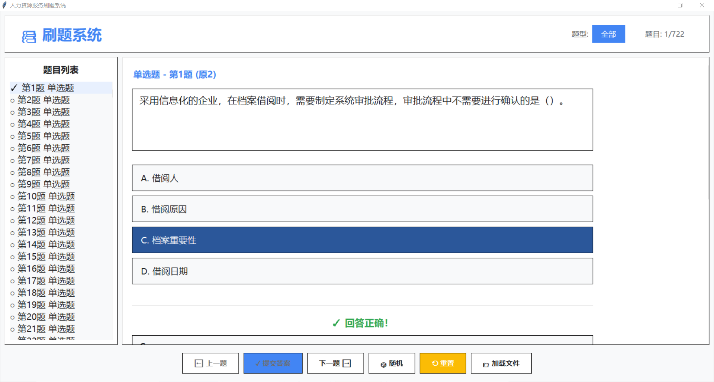

# DrillSet

一个基于 Python Tkinter 的本地刷题小工具，支持从 Word（`*.docx`）或文本（`*.txt`）题库中解析题目，按题型筛选、随机练习、显示答案与解析，并记录答题进度。

## 功能特性
- 自动加载题库：优先加载 `sets/人力资源服务赛项模块一题库.docx`，否则加载 `sets` 目录下第一个 `*.txt`
- 题型识别：支持 `单选题`、`多选题`、`判断题`
- 题目筛选：按题型过滤查看
- 随机练习：一键随机切换题目
- 进度标记：列表中显示未答（○）、已答错（✗）、已答对（✓）
- 答案解析：提交后展示正确答案与解析内容
- 进度重置：清空所有题目的答题状态

## 目录结构
- `quiz_app.py`：图形界面主程序
- `requirements.txt`：第三方依赖
- `start_quiz.bat`：Windows 一键启动脚本
- `sets/`：题库文件目录（支持 `*.docx` / `*.txt`）

## 环境要求
- `Python >= 3.7`
- 依赖：`python-docx`、`Pillow`
- 图形界面使用 `tkinter`（随标准 Python 一起提供，无需额外安装）

## 快速开始
1) 安装依赖
   
   在项目根目录执行：
   
   ```bash
   pip install -r requirements.txt
   ```

2) 放置题库
- 将你的题库文件放到 `sets/` 目录中
- 若存在 `sets/人力资源服务赛项模块一题库.docx` 会优先加载；否则会加载 `sets` 中找到的第一个 `*.txt`

3) 启动应用
- Windows 双击 `start_quiz.bat`
- 或命令行运行：

  ```bash
  python quiz_app.py
  ```

## 题库文本格式说明（*.txt）
每道题的基本结构如下：

```
1. 题干内容……
A. 选项A内容
B. 选项B内容
C. 选项C内容
D. 选项D内容
答案：A
解析：可选的解析内容
```

- 题号：使用半角格式 `数字.`（如 `1.`、`2.`）
- 选项：以 `A.`/`B.`/`C.`/`D.` 开头
- 答案：以 `答案：` 开头；
  - 多选题用中文顿号分隔，比如 `答案：A、C`
  - 判断题可写 `答案：正确`/`答案：错误`，或 `答案：A`/`答案：B`（其中 `A` 代表正确，`B` 代表错误）
- 解析：以 `解析：` 开头，非必填；解析可多行，应用会合并显示

## 题型识别规则
- 判断题：
  - 选项仅有两项，且为“对/错”或“正确/错误”；或答案为“正确/错误/ A / B”且无选项
- 多选题：答案中包含中文顿号（例如 `A、C、D`）
- 单选题：答案为单个选项字母（例如 `A`）或无法匹配其他规则时默认按单选处理

## 界面截图



## 使用小贴士
- 题号与格式尽量规范（如 `1.` 而非 `1、` 或 `1。`），可减少解析误差
- 文本编码使用 `UTF-8`，若解析失败程序会自动尝试 `GBK`
- 题库较大时，首次解析会稍有延迟，耐心等待即可

## 常见问题
- 无法加载题库：确认文件放在 `sets/` 下，且文件后缀为 `*.docx` 或 `*.txt`
- 字体显示异常：GUI 默认使用 `Microsoft YaHei UI`，可在 `quiz_app.py` 中调整 `self.fonts`
- 依赖安装失败：检查 `pip` 是否能访问网络或使用国内源（例如 `pip install -i https://pypi.tuna.tsinghua.edu.cn/simple -r requirements.txt`）

## 许可证
项目许可证见 `LICENSE`

## 致谢
本工具仅用于学习与练习，感谢你使用 DrillSet。若有改进建议或题库格式需求，可在仓库中提出 issue 或直接完善题库文件。
